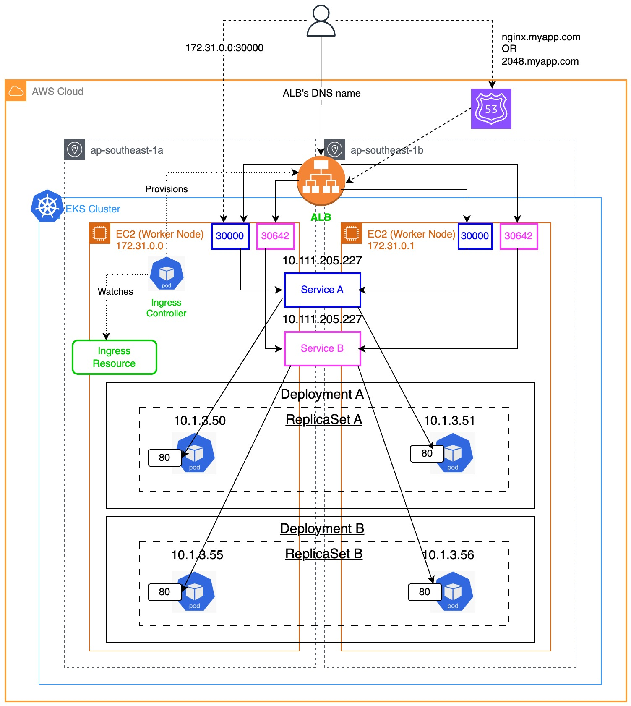

### Check out my article on "Simplifying Ingress Resource on AWS EKS: A Guide to AWS Load Balancer Controller"
https://medium.com/@kennyangjy/simplifying-ingress-resource-on-aws-eks-a-guide-to-aws-load-balancer-controller-835d681aa219



---
> *Caution:* Cost will be involved in creating these resources. For more information, do visit the relavent resource pricing pages as it differs from region to region.
- https://aws.amazon.com/eks/pricing/
- https://aws.amazon.com/ec2/pricing/
---
### To provision the resources in this repository:
1. `git clone https://github.com/Kenny-AngJY/aws-lbc-eks-ingress.git`
2. `terraform init`
3. `terraform apply`
<br>There should be 63 resources to be created.
<br>As no backend is defined, the default backend will be local.
<br>Do wait for 10-15 minutes for the resources to be provisioned.

<br>If the provisioning of the resources is stuck at coredns, showing:

```
module.eks.aws_eks_addon.before_compute["coredns"]: Still creating... [04m20s elapsed]
```

Simply restart the pods of the coredns deployment:

```sh
kubectl rollout restart deployment/coredns -n kube-system
```

4. When you want to install the AWS Load Balancer Controller via the Terraform helm provider, modify the default value for the variable **deploy_aws_load_balancer_controller_via_helm_provider** in *variables.tf* to `true`. Thereafter, apply the changes with `terraform apply`.
<br>There should be 1 resource to be created.
<br>Do wait for 1 minute for the helm chart to be provisioned.

### Clean-up
1. `terraform destroy`